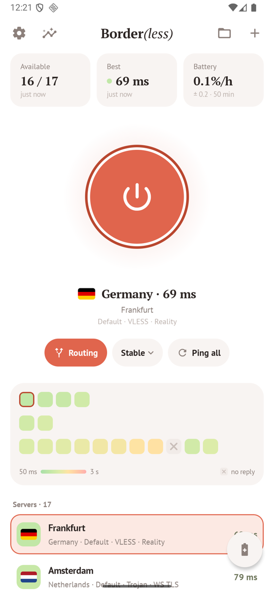
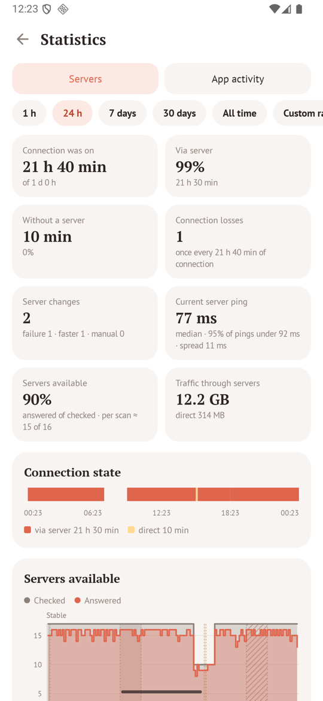
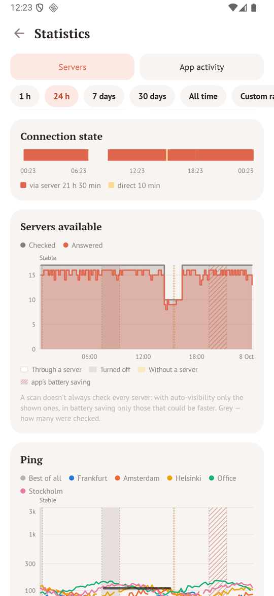
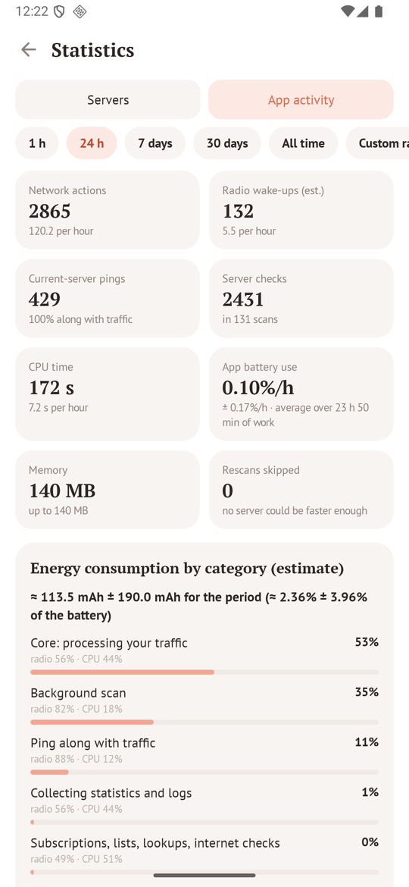
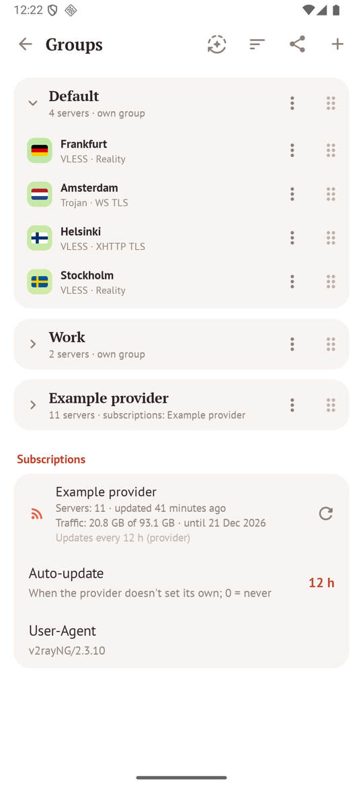
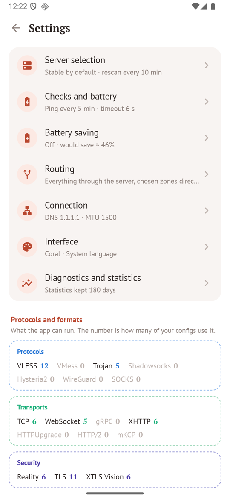

<p align="center">
  <picture>
    <source media="(prefers-color-scheme: dark)" srcset="docs/logo-dark.svg">
    
  </picture>
</p>

<p align="center">
  An Android client for <a href="https://github.com/XTLS/Xray-core">Xray-core</a> that keeps you on a working server by itself<br>
  and is careful with the battery.
</p>

<p align="center">
  <a href="https://github.com/timofeykhodykin/borderless/releases/latest"></a>
  <a href="https://github.com/timofeykhodykin/borderless/releases"></a>
</p>

<p align="center">
  
  
  
  
  <a href="LICENSE"></a>
</p>

<p align="center">
  
  
  
  
  
  
</p>

> Most phones need the `arm64-v8a` APK.

**About this project.** Border(less) is a research proof of concept for one engineering question: *can a phone
keep choosing the best of several network servers continuously while spending as little energy as possible on that
choice?* The app answers it in practice — servers are checked only when a check can pay off, checks ride along with
traffic the phone sends anyway, scans stop as soon as the answer is known, and every decision's cost is measured on
the device itself (CPU time, radio time, battery current) and shown in its statistics. It is a personal technical
experiment, published as is, without any warranty and without any service behind it: it ships no servers and
connects only to the servers its user adds. Use it only in line with the laws and the network rules that apply to
you.

<details>
<summary>О проекте (по-русски)</summary>

Border(less) — исследовательский proof of concept для одного инженерного вопроса: *может ли телефон непрерывно
выбирать лучший из нескольких сетевых серверов, тратя на этот выбор как можно меньше энергии?* Приложение отвечает
на него на практике: серверы проверяются только тогда, когда проверка может окупиться, проверки идут попутно с
трафиком, который телефон и так передаёт, сканирование останавливается, как только ответ найден, а цена каждого
решения измеряется на самом устройстве (время процессора, время работы радиомодуля, ток батареи) и видна в
статистике. Это личный технический эксперимент, опубликованный «как есть», без каких-либо гарантий и без какого-либо
сервиса за ним: в приложении нет своих серверов, оно подключается только к серверам, которые добавил сам
пользователь. Используйте его только в соответствии с законами и правилами сетей, которые к вам применимы.

</details>

## What it does

**Picks the server for you.** The server in use is watched mostly through its traffic counters, without extra
requests. When it stops working, every server is checked (the ones that worked recently first) and the app moves
to the first that answers, after a short wait for a faster one. If none answers, traffic goes direct (or is
paused — your choice) and the app keeps retrying. A network change (Wi-Fi ↔ mobile) rebuilds the tunnel at once.

**Strategies.** *Stable* moves only to a clearly faster server, *Fastest* chases the best ping, *On failure*
never optimises, *Manual* stays where you put it. Switching the strategy re-chooses the server by its rules.

**Protocols.** VLESS (Reality, Vision, XHTTP, gRPC, WebSocket, HTTPUpgrade, mKCP), VMess, Trojan, Shadowsocks
(incl. 2022), Hysteria2 (obfs, port hopping), WireGuard, SOCKS5 and any Xray JSON config, including chains through
`dialerProxy`.

**Subscriptions.** base64, plain lists of links or Xray JSON; name, traffic and expiry from the provider's
headers; automatic updates on the provider's schedule. If the provider can't be reached directly, the
subscription is downloaded through one of your servers. Broken links and failed downloads are explained in plain
words.

**Groups.** Put servers and whole subscriptions into folders, drag to reorder, hide servers, rename them.
*Auto-visibility* can keep just the servers that work best for you in rotation; *auto-sort* shows them in the order
they are checked.

**Routing.** Ready-made domain zones — a region's sites (in its domains and elsewhere), its network addresses and
the apps that work there only without a tunnel — go direct, everything else through the server; a second mode
sends only the sites on the zones' lists through the server. The lists refresh themselves every few days (only the
changed categories are downloaded). Apps you choose work without the tunnel and don't see it. Your own lists of
sites in either direction, an optional ad filter.

**Battery saving mode.** One button, or together with the phone's battery saver: checks and rescans become rarer
and smarter, and among working servers the protocols that cost the core less energy are preferred — measured on
your phone. The expected saving is shown on the button.

**Statistics.** Availability and ping of every server, connection states over time, failures and switches,
traffic, per-subscription views. A separate tab shows what the app itself does and costs: network actions, CPU
time, an estimate of its battery use with error margins (from the phone's own power profile), and optional real
current measurement. Everything can be exported to CSV.

**Quick Settings and status bar.** A Quick Settings tile (long press opens the app) and an optional status-bar
icon.

**Sharing.** A server, a group, a subscription or everything — as plain links any client understands, or in the
app's own format that also keeps groups and hidden servers. Import by pasting, camera QR or a QR code in a
picture.

**Privacy and security.** App data and logs are encrypted at rest (AES-GCM, key in the Android Keystore);
cleartext HTTP is disabled; logs never contain keys or full subscription URLs; no local proxy is left open for
other apps.

## Install

Download the APK for your phone from [Releases](https://github.com/timofeykhodykin/borderless/releases) (almost
always `arm64-v8a`), open it and allow installing from this source. Updates install over the previous version and
keep all your data.

## Build

JDK 17 and the Android SDK (platform 37):

```sh
./gradlew :app:assembleDebug        # app/build/outputs/apk/debug/app-arm64-v8a-debug.apk
./gradlew :app:testDebugUnitTest
```

The core (`libv2ray.aar` from [AndroidLibXrayLite](https://github.com/2dust/AndroidLibXrayLite)) is downloaded on
the first build. A signed release build needs `keystore.properties` (`storeFile`, `storePassword`, `keyAlias`,
`keyPassword`) in the project root. The routing lists bundled with the app are rebuilt with
`python3 scripts/build_geo.py` from the sources named in `app/src/main/assets/regions.json`.

## License

Border(less)'s own code: [PolyForm Noncommercial License 1.0.0](LICENSE) — free to use, study, change and share
for any noncommercial purpose; selling it or using it commercially is not allowed
([Russian translation](LICENSE.ru.md)). Components it includes keep their own licenses (Xray-core MPL-2.0,
libv2ray LGPL-3.0, routing lists GPL-3.0, fonts SIL OFL, and others): see
[THIRD_PARTY_NOTICES.md](THIRD_PARTY_NOTICES.md).
